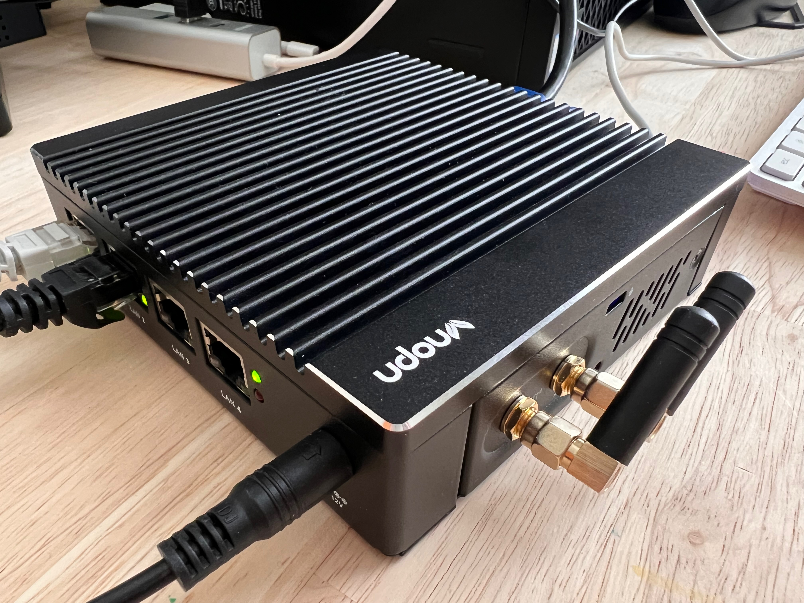
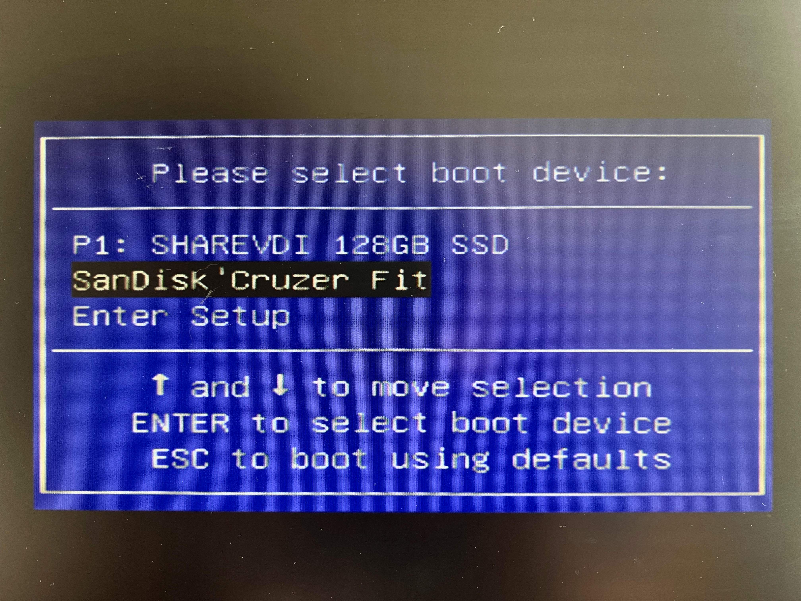
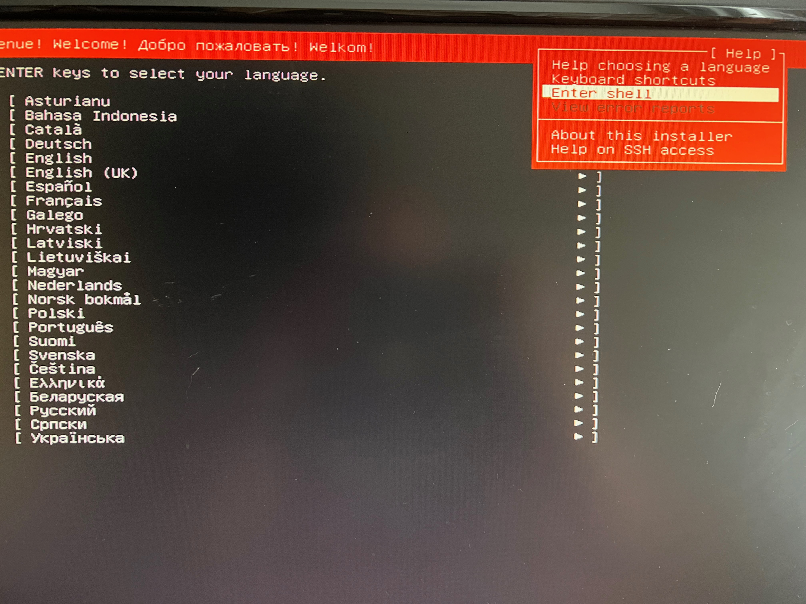
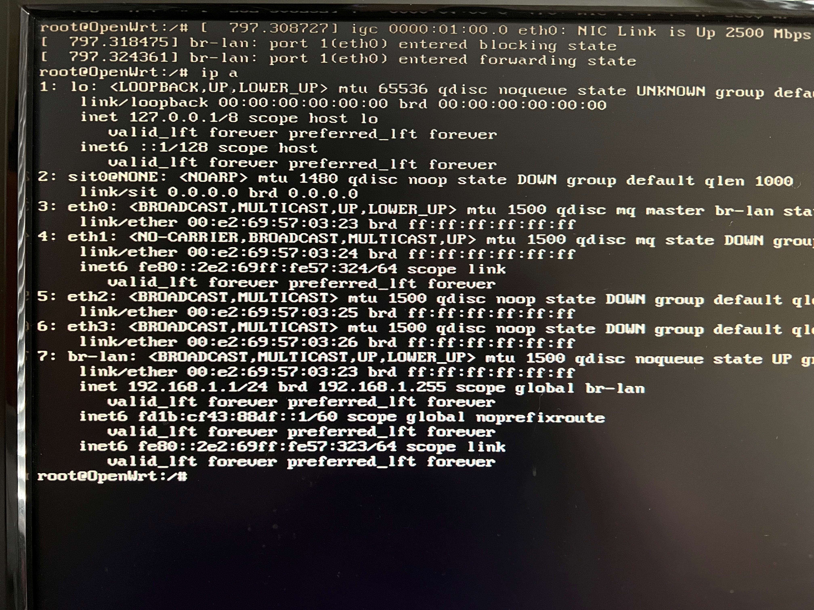
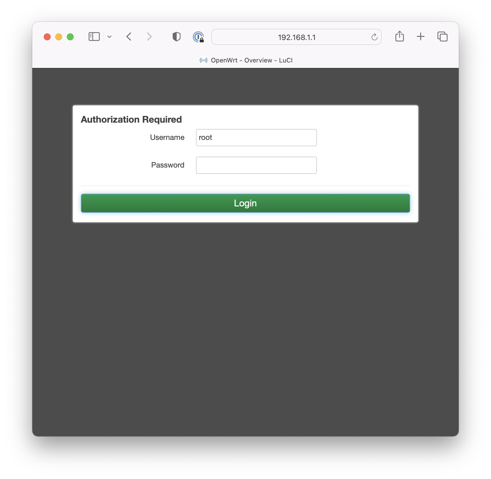
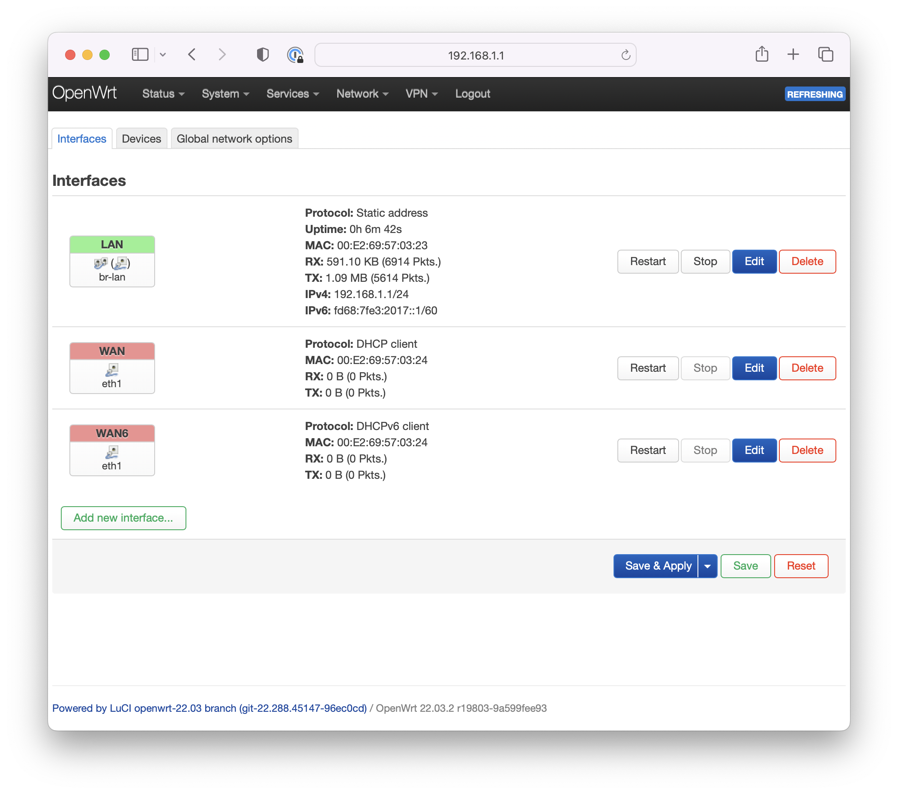
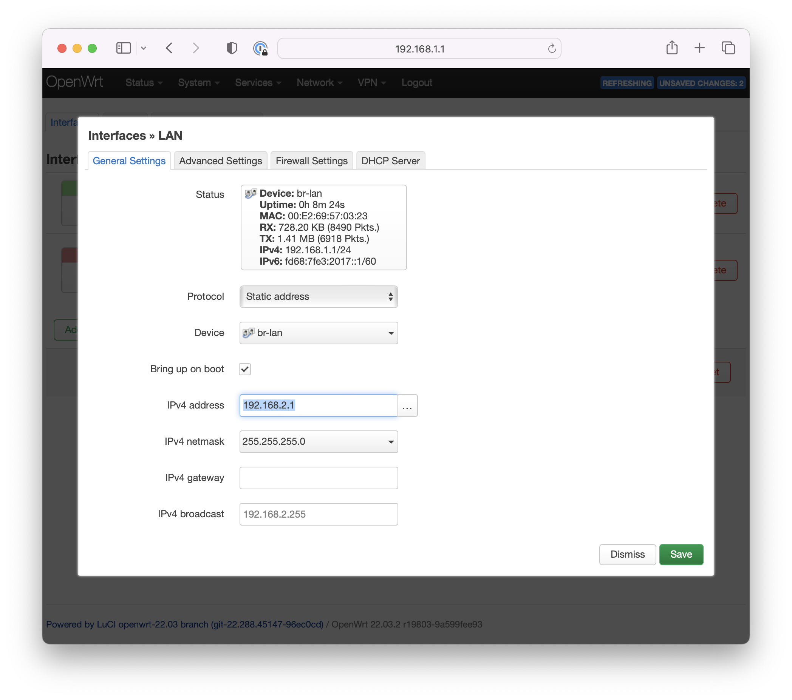
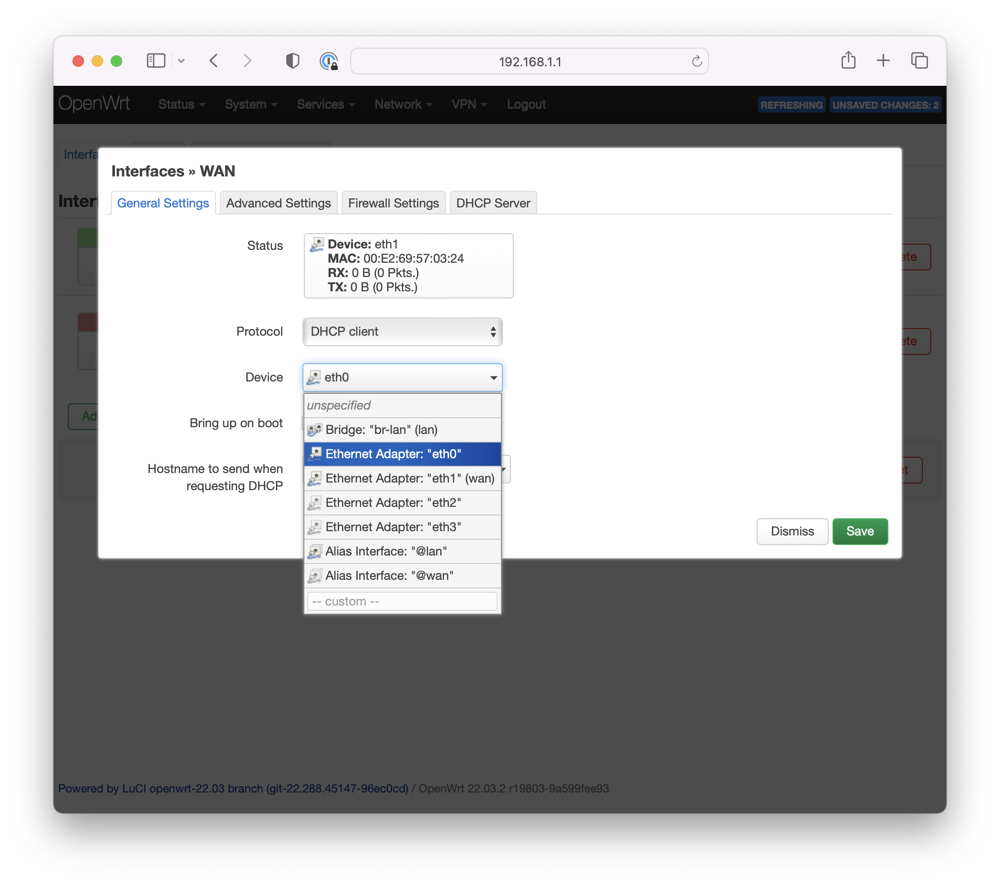
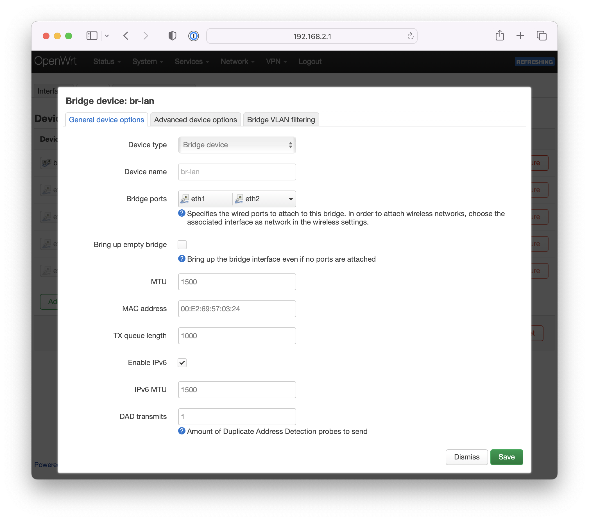

I needed to replace my [UniFi Security Gateway](https://store.ui.com/products/unifi-security-gateway), which recently died, so I purchased a [VNOPN Micro Firewall Appliance](https://a.co/d/0fEIZwK) to run [OpenWrt](https://openwrt.org/). Coming from a managed Unifi device, the setup was new to me, so I've documented it below.

## Prerequisites

I started with these items:

* [USB flash drive with Ubuntu]()
* Ethernet cables and possibly a USB ethernet adapter (I'm using the [D-Link USB C to Ethernet Adapter](https://a.co/d/bO4tqS5))
* The VNOPN appliance with a connected keyboard and monitor
* [OpenWrt firmware image](https://openwrt.org/start) for your device. I used a [custom-built image](tobiasmcnulty/router-openwrt).by [Tobias McNulty](https://tobiasmcnulty.com/). Specifically, a disk image using the traditional OpenWrt layout: a squashfs read-only root filesystem and a read-write partition where settings and packages are stored.

## My basic network layout

My router sits behind my AT&T fiber modem, so my traffic is NAT'd since I don't have something like an [AT&T Residential Gateway Bypass](https://github.com/jaysoffian/eap_proxy) setup anymore:


flowchart LR
    router[AT&T ARRIS router] --> VNOPN --> switch[NETGEAR switch] --> aps[Access Points]


## Install OpenWRT

Connect a [USB flash drive with Ubuntu]() to the VNOPN appliance. (It's probably possible to pre-load your desired OpenWrt firmware onto the USB drive, but I just download it here. Make sure an ethernet cable to your upstream modem is connected to the **LAN 1** port.

Boot the VNOPN and immediately **press F7** to select a boot device. Choose your USB drive and press enter:



When the installer launches, use the up arrow (↑) to navigate to the **Help** menu in the top right, and select **Enter shell**:



From the terminal prompt, download an Openwrt image. I used [tobiasmcnulty/router-openwrt v22.03.2](https://github.com/tobiasmcnulty/router-openwrt/releases/tag/22.03.2_x86_64) and created a Bitly link for the `openwrt-22.03.2-x86-64-generic-squashfs-combined.img.gz` image, to make it easier to type into the terminal. Download and decompress the image:

```sh
cd /tmp
wget https://bit.ly/3UcZ23h -O openwrt-squashfs.img.gz
gunzip openwrt-squashfs.img.gz
```

Identify the internal drive you wish to install Openwrt on (in my case `/dev/sda`):

```sh
lsblk
```

Write the disk image to the VNOPN internal drive:

```sh
dd if=openwrt-squashfs.img bs=1M of=/dev/sda
```

And reboot:

```sh
reboot
```

Now plug an ethernet cable from your laptop into the LAN 1 port. You should see the link become active:



## Configure OpenWRT

Connect to the web UI by accessing http://192.168.1.1 in your browser. By default, you can log in without using a password:



Navigate to **Network→Interfaces** to see the default interfaces:



Next we'll queue up a few changes:

* My network will use NAT behind my AT&T router, which uses the **192.168.1.x** DHCP range, so I want to use non-conflicting address: **192.168.2.1**. Edit the LAN interface and change the IPv4 address to **192.168.2.1**:

    

* I want **LAN 1** to be the **WAN** port connected to my AT&T router, so edit the **WAN interface** and move it to the **eth0 device** (e.g. the **LAN 1** port):

    

* I want **LAN 2** and **LAN 3** to be my **LAN** network. Switch to the devices tab, click configure on the `br-lan` device, and select the **eth1** and **eth2** bridge ports (LAN 1 and LAN 2, respectively):

    

* Lastly, delete WAN6 interface

Select Apply and Save. Switch your laptop ethernet cable to **LAN 2** and plug your upstream ethernet cable into **LAN 1**.

Now you should be able to access https://192.168.2.1 from your browser. You should also have working Internet! If everything looks good, just plug your network switch into **LAN 2** or **LAN 3**.
